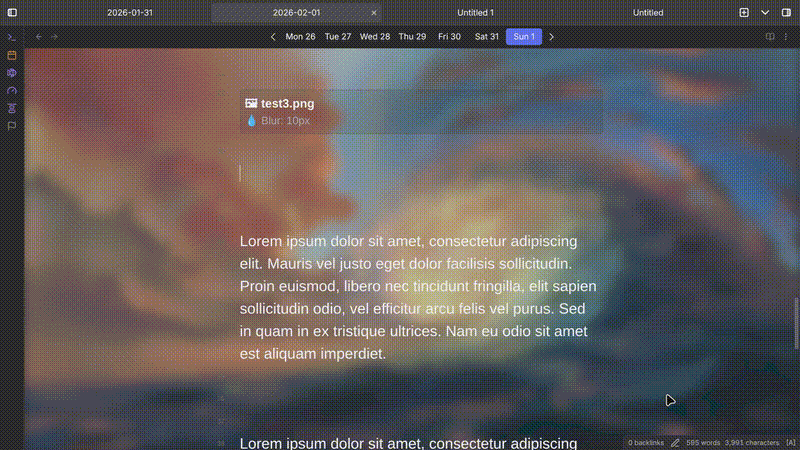

# Dynamic Background for Obsidian

An immersive Obsidian plugin that dynamically changes the note background as you scroll. Perfect for visual storytelling, role-playing games (RPGs), or creating atmospheric reading experiences.




## ✨ Features

- **Scroll-Triggered Changes:** Backgrounds change automatically as you scroll to different sections of your note.
- **Visual Customization:** Control opacity, blur, size, position, and **visual style** for each image.
- **Rich Preset Styles:** Choose from beautiful presets like **Glass**, **Frost**, **Card**, or **Zen** to make your text pop.
- **Clean Reading Experience:** Backgrounds work seamlessly in both **Live Preview** and **Reading View**.
- **Non-Intrusive:** The configuration blocks are visible in Edit mode but completely hidden in Reading mode.
- **Isolated Styling:** Backgrounds apply only to the note content, leaving the sidebar and settings UI untouched.

## 🚀 Usage

Simply add a `bg` code block anywhere in your note. When you scroll to that block, the background will update.

```bg
path: forest.jpg
blur: 5px
opacity: 0.8
style: glass

```

### Advanced Example

You can combine multiple properties to achieve the perfect look:

```bg
path: mystical-cave.png
blur: 0px
opacity: 1
size: cover
position: top center
repeat: no-repeat
style: frost

```

## 🎨 Visual Styles (New!)

You can now apply different visual styles to your text container to improve readability against the background. Set this globally in the **Plugin Settings** or per block using the `style` parameter.

| Style | Description |
| --- | --- |
| `glass` | **(Default)** Standard frosted glass effect with noise texture. |
| `frost` | Heavy blur and saturation. Icy look, high readability. |
| `mist` | Light blur. Steamy look, keeps background details visible. |
| `crisp` | No blur, darker background. Sharp and clean. |
| `card` | Solid, high-contrast look. Like a sheet of paper on a desk. |
| `float` | Fully transparent. Text floats directly on the image. |
| `zen` | Ultra low blur (focus mode). Minimalist. |
| `off` | Disables the plugin effects for this block. |

## ⚙️ Configuration Options

| Option | Description | Default | Example |
| --- | --- | --- | --- |
| `path` | The exact name of the image file in your vault. | **(Required)** | `image.png` |
| `style` | Visual preset for the text container. | `glass` | `frost`, `card`, `zen` |
| `blur` | Applies a blur effect to the background image. | `0px` | `10px` or `5` |
| `opacity` | Sets the transparency level (0.0 to 1.0). | `1` | `0.5` |
| `size` | CSS `background-size` property. | `cover` | `contain`, `100%` |
| `position` | CSS `background-position` property. | `center center` | `top`, `bottom right` |
| `repeat` | CSS `background-repeat` property. | `no-repeat` | `repeat`, `repeat-x` |

# 📦 Installation

1. Download the `main.js`, `manifest.json`, and `styles.css` from the [Releases](https://www.google.com/search?q=../../releases) page.
2. Create a folder named `dynamic-background` inside your vault's `.obsidian/plugins/` directory.
3. Move the downloaded files into that folder.
4. Reload Obsidian and enable the plugin in settings.

## 🤝 Contributing

Contributions are welcome! If you find a bug or want to suggest a feature, please create an issue or submit a pull request.

## 📄 License

MIT License

